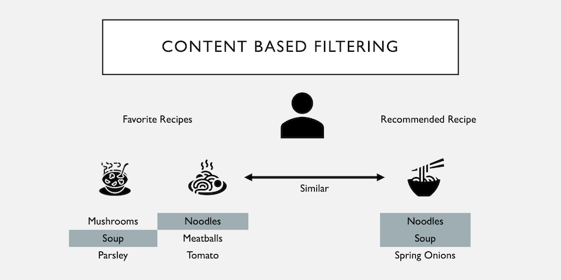
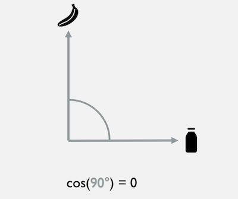
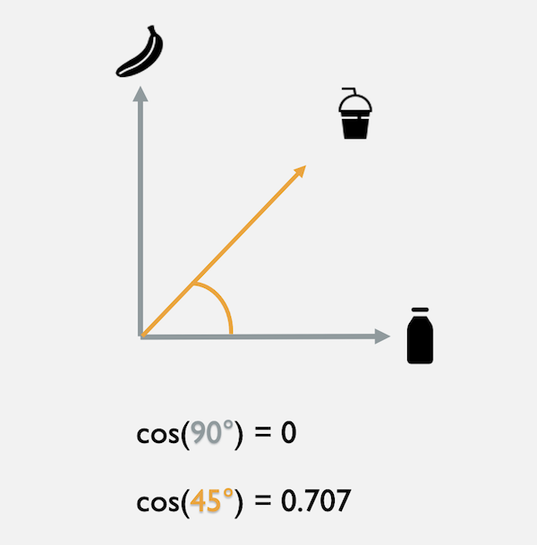

# recipe_recommender
The app recommends recipes based on the input ingredients and favourite recipes.

## Recommender

### Content Based Filtering

The recommender uses Content Based Filtering that uses the characteristics of items to make a recommendation for a user (see figure 1).

\
*Figure 1: Content Based Filtering*

The figure 1 shows two favorite recipes of a user. A mushroom soup with parsley and a noodles with meatballs in tomato sauce. Based on the ingredients of theses two favorite recipes the user gets a recommendation for a new recipe. The recommendation is a noodle soup with spring onions.

### Cosine Similarity

The Cosine Similarity is the metric to measure the similarity between documents or in this case recipes. A value of 0 means no similarity and a value of 1 full similarity. In the following example a 2 dimensional vector space is used.

\
*Figure 2: Cosine Similarity between banana and milk*

The figure 2 shows in one dimension a banana and in the other a milk. The angle between both is 90° and the resulting value for the cosine is 0. That means that the banana has no similarity with a milk. But what happens if you mix a banana and milk to a banana shake.

\
*Figure 3: Cosine Similarity between banana shake and milk*

Due to the fact that the banana shake is a mixure of a banana and a milk the vector is between those two ingredients/products in figure 3. Therefore the angle for the banana shake between the milk (also banana shake to banana) is 45° and the resulting value for the cosine is 0.707.

## Database

The database used for this project is PostgreSQL. The following image shows the schema of the database.


### Tables

__Ingredients__

The `ingredients` table contains all ingredient used for the recipes.

* `id` (string): hash generated id based on the ingredient nane
* `name` (string): name of the ingredient

__Recipes__

The `recipes` table contains the basic information of all recipes.

* `id` (string): given id for the recipe combined of incremented number and origin
* `name` (string): title of the recipe
* `energy_kj` (float): kilo joule per portion for the recipe
* `energy_kcal` (float): kilo calories per portion for the recipe
* `fat` (float): amount of fat per portion for the recipe
* `sat_fat` (float): amount of saturated fat per portion for the recipe
* `carbs` (float): amount of carbs per portion for the recipe
* `sugar` (float): amount of sugar per portion for the recipe
* `protein` (float): amount of protein per portion for the recipe
* `salt` (float): amount of salt per portion for the recipe
* `preparation` (integer): time to prepare the recipe
* `difficulty` (string): difficulty to prepare to the recipe

__RecipeLinks__

The `recipe_links` table links the recipes to the ingredients with amounts and units.

* `id` (string): hash generated id based on the `recipe_id`, `ingredient_id`, `amount` and `unit`
* `recipe_id` (string): id of the recipe
* `ingredient_id` (string): id of the ingredient
* `amount` (float): amount of the ingredient
* `unit` (string): unit of the amount

__RecipeSteps__

The `recipe_steps` table contains the steps to prepare each recipe.

* `id` (string): hash generated id based on the `recipe_id`, `step` and `text`.
* `recipe_id` (string): id of the recipe
* `step` (integer): number of the step
* `text` (string): text of the current step

__Users__

The `users` table contains all the user information.

* `id` (integer): increasing integer starting from 1
* `name` (string): name of the user

__UserFavorites__

The `user_favorites` table contains all favorite recipes of the users.

* `id` (string): hash generated id based on the `user_id` and `recipe_id`
* `user_id` (string): id of the user
* `recipe_id` (string): id of the recipe

### Data

This repository is currently not providing any recipe data for the database.


## Application

### Installing Packages

The necessary packages used to run the application are in the `requirements.txt` and installed as follows:

```bash
pip install -r requirements.txt
```

### Configuration file

The information to connect to the database are stored in the `.env` file and has the following structure:

```txt
POSTGRES_USER='user'
POSTGRES_PASSWORD='password'
POSTGRES_HOST='127.0.0.1'
POSTGRES_PORT='5432'
POSTGRES_DB='database name'
```


### Running the App

The recipe recommender is using streamlit to run the application on a web browser. To run the  \
application the following command needs to be executed:

```bash
streamlit run app.py
```

If the command is not executed inside the folder of the app, please add the path (`~/path/app.py`)

### Using the APP

The following animation shows the basic functionality of the recipe recommender.


1. Choose the ingredients you want to use
2. Set the amount of recommended recipes you want to receive
3. Push __recommend recipes__ to get recommendations
4. Select a recipe and push __eat recipe__ to see full information